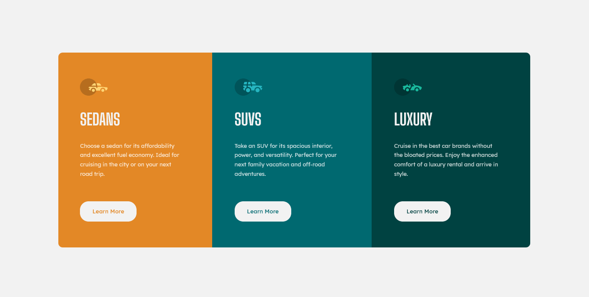
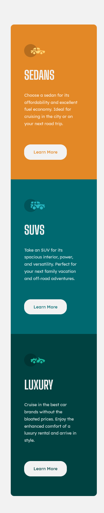

# Frontend Mentor - 3-column preview card component solution

This is a solution to the [3-column preview card component challenge on Frontend Mentor](https://www.frontendmentor.io/challenges/3column-preview-card-component-pH92eAR2-).

## Table of contents

- [Overview](#overview)
  - [The challenge](#the-challenge)
  - [Screenshot](#screenshot)
  - [Links](#links)
- [My process](#my-process)
  - [Built with](#built-with)
  - [What I learned](#what-i-learned)

## Overview

### The challenge

Users should be able to:

- View the optimal layout depending on their device's screen size (moblie: 375px, desktop: 1366px)
- See hover states for interactive elements

### Screenshot

### Links

[Frontend Mentor](https://www.frontendmentor.io)
[Challenge](https://www.frontendmentor.io/challenges/3column-preview-card-component-pH92eAR2-)

## My process

Check out [git commits for this repo](https://github.com/ravviolo/3-column-preview-card-component-main/commits/main)

### Built with

- SASS
- Flexbox
- Desktop-first workflow

### What I learned

- Basic Sass
- Usage of BEM methodology
- Building a layout
